# Laporan Progres Mingguan - SORA
**Kelompok** : 6

**Mitra** : Rumah Makan Salwa

**Pekan ke -** : 13

**Tanggal** : 08/05/2025

---
## Anggota Kelompok ##

- **Amazia Devid Saputra dengan NIM 10231013** 
- **Dyno Fadillah Ramadhani dengan NIM 10231033**
- **Rani Ayu Dewi dengan NIM 10231079**
- **Siti Nur Azizah Putri Awni dengan NIM 10231087**

---

## Progress Summary
Pada minggu ini, tim telah berhasil mengimplementasikan dan menguji berbagai fitur inti sistem, termasuk manajemen menu, fungsi keranjang, sistem reservasi, dan integrasi WhatsApp. Fokus utama adalah memastikan kualitas dan keandalan sistem melalui pengujian menyeluruh.

## Accomplished Tasks
- Implementasi dan pengujian sistem manajemen menu dengan fitur CRUD lengkap
- Pengembangan dan pengujian fungsi keranjang belanja dengan kalkulasi harga
- Implementasi sistem reservasi meja dengan validasi ketersediaan
- Integrasi sistem notifikasi WhatsApp dengan manajemen nomor kontak
- Pengembangan unit test untuk memastikan keandalan sistem

## Challenges & Solutions
- **Challenge 1**: Kompleksitas dalam mengelola status reservasi dan ketersediaan meja secara real-time
  - **Solution**: Implementasi sistem validasi yang ketat dan mekanisme pembaruan status otomatis untuk mencegah double booking

- **Challenge 2**: Integrasi WhatsApp yang memerlukan penanganan berbagai format nomor dan validasi
  - **Solution**: Pengembangan sistem validasi format nomor yang robust dan implementasi manajemen multiple nomor untuk fleksibilitas

- **Challenge 3**: Memastikan konsistensi data antara frontend dan backend dalam fungsi keranjang
  - **Solution**: Implementasi state management yang efektif dan pengujian menyeluruh untuk setiap operasi keranjang

## Next Week Plan
### Bugfix Report
- Analisis dan perbaikan bug pada sistem reservasi
- Penanganan masalah sinkronisasi data keranjang
- Perbaikan validasi format nomor WhatsApp
- Optimasi performa loading halaman menu

### Usability Test Report
- Pengujian dengan 3 pengguna berbeda:
  - Pengguna baru (first-time user)
  - Pengguna reguler (regular customer)
  - Admin sistem
- Fokus pengujian:
  - Kemudahan navigasi
  - Proses pemesanan
  - Sistem reservasi
  - Panel admin

### Deployment Plan
- Hosting:
  - Persiapan server production
  - Konfigurasi environment
  - Setup database production
- Domain:
  - Registrasi domain
  - Konfigurasi DNS
  - Setup SSL certificate
- Monitoring:
  - Setup error tracking
  - Implementasi logging system
  - Konfigurasi backup system

## Contributions
- **Amazia Devid Saputra**: 
  - Frontend development (React components)
  - API integration
  - State management implementation

- **Dyno Fadillah Ramadhani**: 
  - Backend architecture
  - Filament panel configuration
  - Resource implementation
  - Authentication system

- **Rani Ayu Dewi**: 
  - UI/UX design
  - Frontend routing
  - Component styling
  - API documentation

- **Siti Nur Azizah Putri Awni**: 
  - Database design
  - API development
  - Testing implementation
  - Documentation

## Screenshots / Demo
## 1. Core Feature #4

### Payment System Implementation

#### 1. Halaman Checkout (Sebelum Pembayaran)
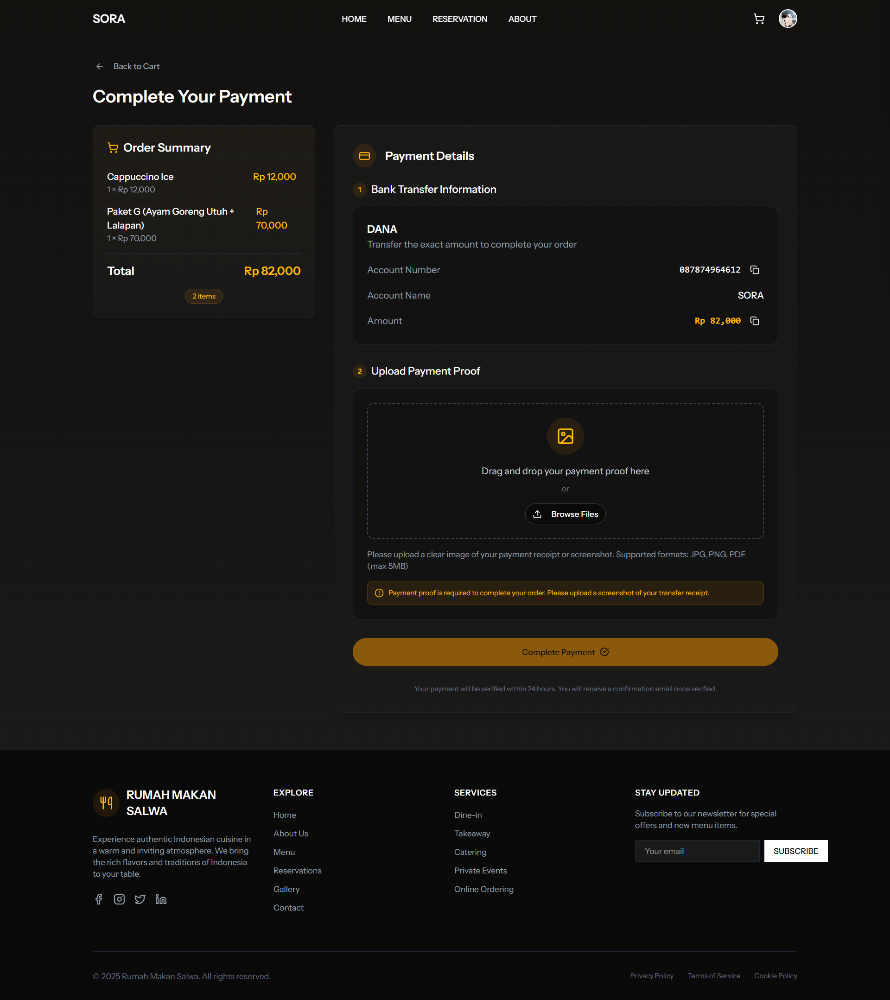
*Gambar 1: Halaman checkout sebelum pembayaran*

Fitur pada halaman ini:
- Menampilkan ringkasan pesanan yang akan dibayar
- Informasi detail item yang dipesan beserta jumlahnya
- Perhitungan subtotal dan total pembayaran
- Opsi untuk memilih metode pembayaran
- Tombol konfirmasi untuk melanjutkan ke proses pembayaran

#### 2. Konfirmasi Pembayaran
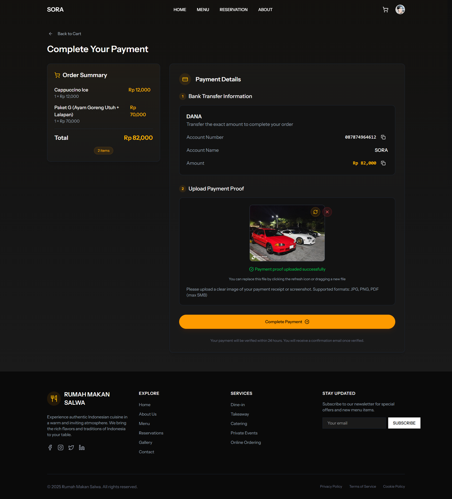
*Gambar 2: Konfirmasi detail pembayaran*

Fitur pada halaman ini:
- Tampilan detail transaksi lengkap
- Informasi metode pembayaran yang dipilih
- Waktu dan tanggal transaksi
- Nomor order/transaksi
- Tombol untuk memproses pembayaran
- Opsi untuk membatalkan transaksi

#### 3. Halaman Sukses
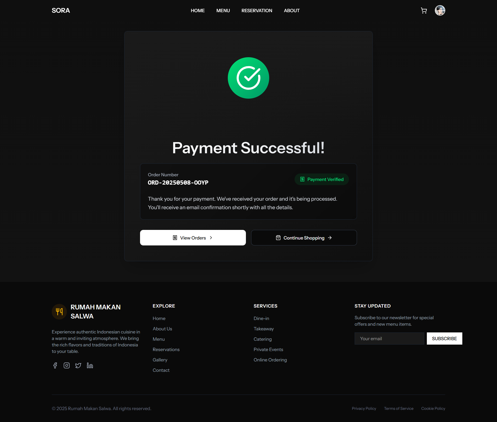
*Gambar 3: Halaman sukses setelah pembayaran*

Fitur pada halaman ini:
- Notifikasi sukses pembayaran
- Detail transaksi yang berhasil
- Informasi status pembayaran
- Opsi untuk melihat riwayat transaksi
- Tombol untuk kembali ke halaman utama
- Notifikasi yang akan dikirim ke pengguna

---

## 2. Admin Panel

### 1. Manajemen Bank
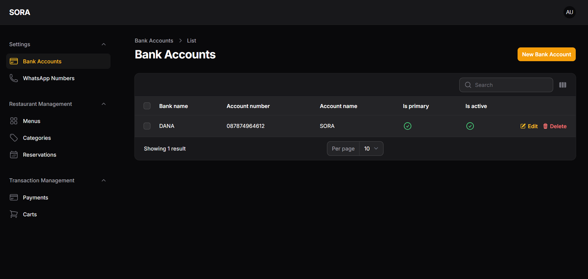
*Gambar 1: Halaman Manajemen Bank*

Fitur pada halaman ini:
- Daftar rekening bank yang terdaftar
- Informasi detail bank (nama bank, nomor rekening, nama pemilik)
- Opsi untuk menambah, mengedit, dan menghapus rekening
- Status aktif/nonaktif rekening
- Validasi format nomor rekening

### 2. Pengaturan WhatsApp
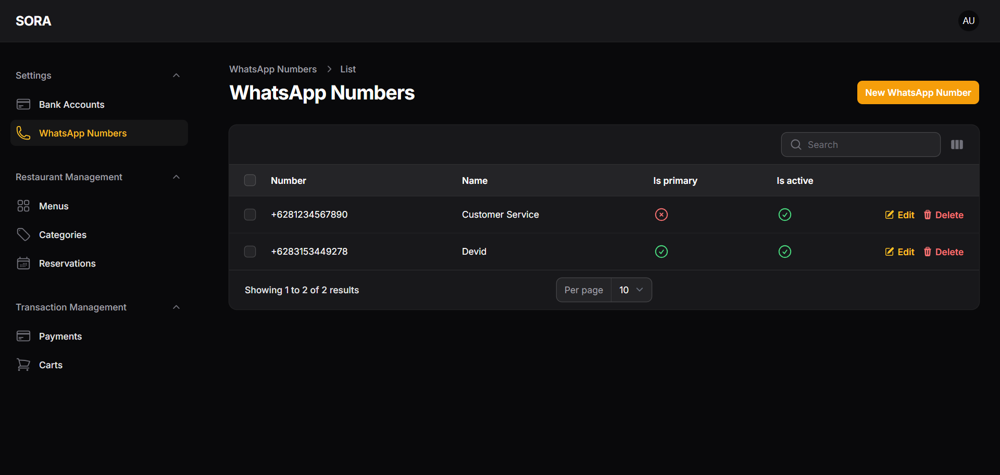
*Gambar 2: Halaman Pengaturan WhatsApp*

Fitur pada halaman ini:
- Konfigurasi nomor WhatsApp utama
- Pengaturan template pesan notifikasi
- Manajemen multiple nomor WhatsApp
- Status koneksi WhatsApp
- Log aktivitas pengiriman pesan

### 3. Manajemen Menu
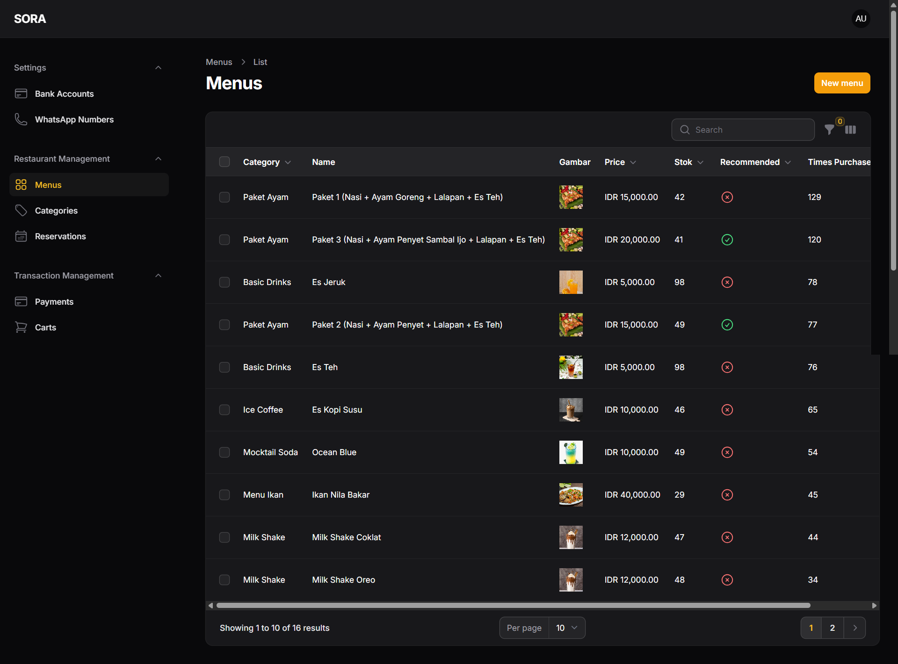
*Gambar 3: Halaman Manajemen Menu*

Fitur pada halaman ini:
- Daftar menu makanan dan minuman
- Informasi detail menu (nama, harga, deskripsi)
- Upload dan manajemen gambar menu
- Status ketersediaan menu
- Pengelompokan menu berdasarkan kategori

### 4. Manajemen Kategori
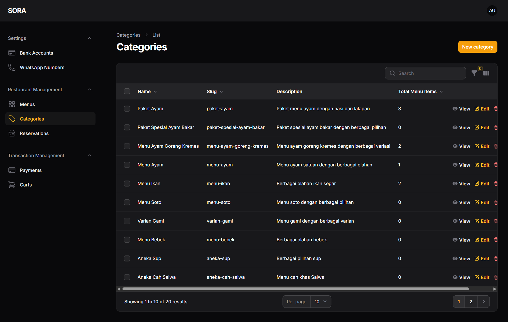
*Gambar 4: Halaman Manajemen Kategori*

Fitur pada halaman ini:
- Daftar kategori menu
- Pengaturan urutan kategori
- Opsi untuk menambah dan mengedit kategori
- Jumlah menu per kategori
- Status aktif/nonaktif kategori

### 5. Manajemen Reservasi
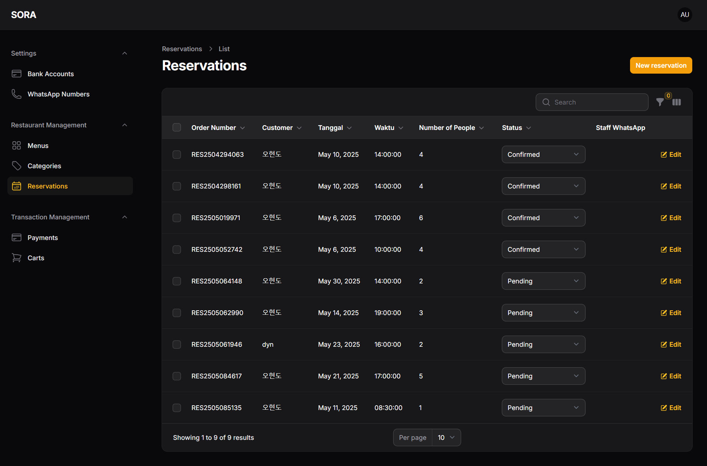
*Gambar 5: Halaman Manajemen Reservasi*

Fitur pada halaman ini:
- Daftar reservasi yang masuk
- Detail informasi reservasi (tanggal, waktu, jumlah orang)
- Status reservasi (pending, confirmed, cancelled)
- Filter berdasarkan tanggal dan status
- Opsi untuk mengkonfirmasi atau membatalkan reservasi

### 6. Manajemen Pembayaran
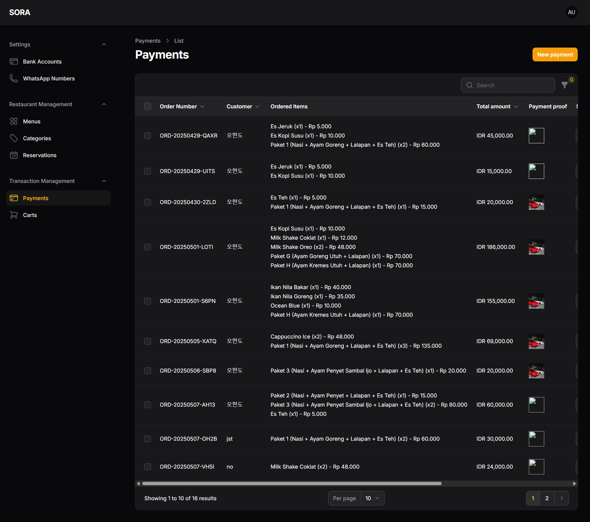
*Gambar 6: Halaman Manajemen Pembayaran*

Fitur pada halaman ini:
- Riwayat transaksi pembayaran
- Detail pembayaran (metode, jumlah, status)
- Filter berdasarkan tanggal dan status
- Konfirmasi pembayaran manual
- Export laporan pembayaran

### 7. Manajemen Keranjang
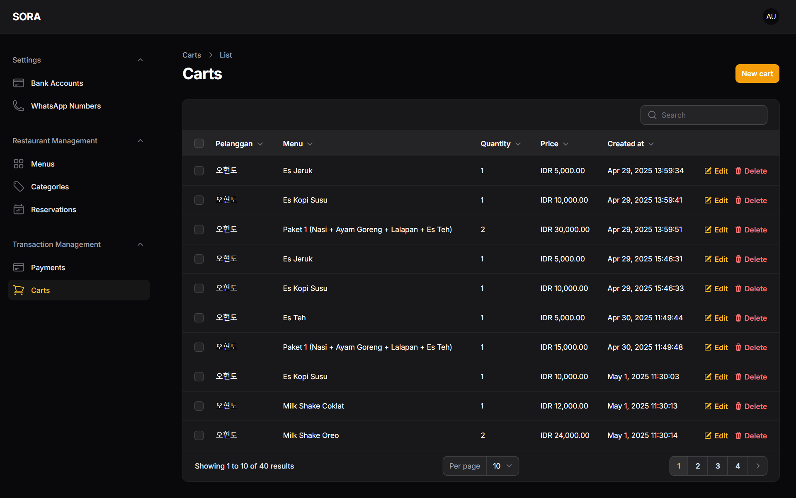
*Gambar 7: Halaman Manajemen Keranjang*

Fitur pada halaman ini:
- Daftar keranjang aktif
- Detail item dalam keranjang
- Status keranjang (active, abandoned, completed)
- Filter berdasarkan status dan tanggal
- Opsi untuk membersihkan keranjang yang tidak aktif

---

## 3. Data Visualization

### Dashboard Superadmin
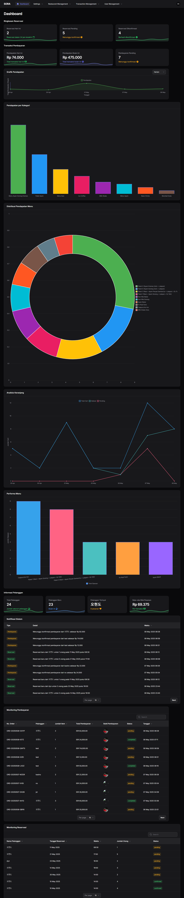
*Gambar: Dashboard Superadmin dengan Visualisasi Data*

Fitur visualisasi data pada dashboard:

1. **Statistik Utama**
   - Total pendapatan hari ini
   - Jumlah pesanan aktif
   - Jumlah reservasi hari ini
   - Jumlah pengguna baru

2. **Grafik Penjualan**
   - Tren penjualan harian
   - Perbandingan penjualan dengan periode sebelumnya
   - Analisis menu terlaris
   - Distribusi metode pembayaran

3. **Analisis Reservasi**
   - Tingkat okupansi meja
   - Pola reservasi per hari
   - Rata-rata durasi reservasi
   - Statistik pembatalan

4. **Insight Pengguna**
   - Pertumbuhan pengguna
   - Aktivitas pengguna per jam
   - Pola pemesanan
   - Tingkat retensi pelanggan

5. **Monitoring Real-time**
   - Status pesanan aktif
   - Reservasi yang akan datang
   - Notifikasi penting
   - Alert sistem

6. **Laporan Performa**
   - KPI bisnis utama
   - Analisis tren
   - Perbandingan periode
   - Prediksi penjualan

---

Link Github Repository untuk website : https://github.com/brosora6/sora.git

Link Github Repository untuk Laporan : https://github.com/justdyn/laporan_proweb.git