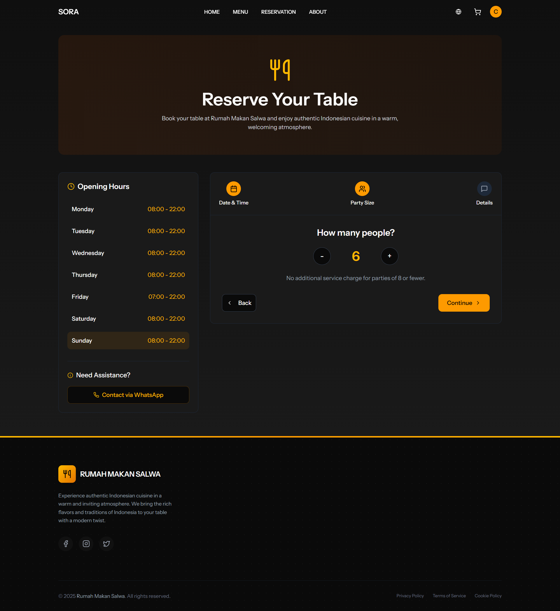

# Laporan Progres Mingguan - SORA
**Kelompok** : 6

**Mitra** : Rumah Makan Salwa

**Pekan ke -** : 14

**Tanggal** : 15/05/2025

---
## Anggota Kelompok ##

- **Amazia Devid Saputra dengan NIM 10231013** 
- **Dyno Fadillah Ramadhani dengan NIM 10231033**
- **Rani Ayu Dewi dengan NIM 10231079**
- **Siti Nur Azizah Putri Awni dengan NIM 10231087**

---

## Progress Summary
Pada minggu ini, tim fokus pada penyelesaian pengembangan fitur utama aplikasi SORA, melakukan perbaikan bug pada modul reservasi dan pembayaran, serta melakukan usability testing dengan tiga user. 

## Accomplished Tasks
- Implementasi dan penyempurnaan fitur reservasi, pembayaran, dan menu pada aplikasi SORA
- Perbaikan bug pada modul ReservationResource dan PaymentsResource (timezone dan tanggal/waktu)
- Melakukan usability testing dengan 3 user dan mendokumentasikan hasilnya

## Challenges & Solutions
- **Challenge 1:** Bug pada modul ReservationResource dan PaymentsResource terkait perbedaan timezone dan tanggal/waktu yang tidak akurat
  - **Solution:** Mengatur konfigurasi timezone di Laravel, menggunakan Carbon untuk format tanggal/waktu, dan memastikan konsistensi penyimpanan data waktu di database

- **Challenge 2:** Konsistensi evidence usability test antar user (jumlah dan jenis bukti screenshot)
  - **Solution:** Melengkapi evidence untuk setiap user agar jumlah dan jenis bukti sama, serta memberikan deskripsi yang jelas pada setiap screenshot

- **Challenge 3:** Persiapan deployment dan konfigurasi environment production
  - **Solution:** Menyusun deployment plan secara detail, menyiapkan file .env production, dan melakukan pengecekan fitur secara menyeluruh sebelum go-live

## Next Week Plan
- Deploy website ke hosting
- Pengecekan dan pengujian seluruh fitur aplikasi
- Pembuatan dokumentasi akhir proyek

## Contributions
- **Amazia Devid Saputra**: 
  - Frontend development (React components)
  - API integration
  - State management implementation

- **Dyno Fadillah Ramadhani**: 
  - Backend architecture
  - Filament panel configuration
  - Resource implementation
  - Authentication system

- **Rani Ayu Dewi**: 
  - UI/UX design
  - Frontend routing
  - Component styling
  - API documentation

- **Siti Nur Azizah Putri Awni**: 
  - Database design
  - API development
  - Testing implementation
  - Documentation

## Screenshots / Demo
## 1. Bugfix Report (Daftar bug yang ditemukan dan solusinya)
### Bug 1: Tanggal Reservasi Tidak Akurat


**Deskripsi Bug:**
- Tanggal reservasi yang ditampilkan di Filament admin panel tidak sesuai dengan tanggal yang diinput user
- Terjadi perbedaan waktu karena timezone yang tidak dikonfigurasi dengan benar

**Solusi:**
1. Menambahkan konfigurasi timezone di `config/app.php`:
```php
'timezone' => 'Asia/Jakarta',
```
2. Memastikan semua model yang menggunakan tanggal menggunakan timezone yang benar
3. Menggunakan Carbon untuk format tanggal yang konsisten

### Bug 2: Waktu Pembayaran Tidak Akurat


**Deskripsi Bug:**
- Waktu pembayaran yang ditampilkan di Filament admin panel tidak sesuai dengan waktu sebenarnya
- Terjadi karena perbedaan timezone antara server dan aplikasi

**Solusi:**
1. Mengatur timezone di model Payment:
```php
protected $casts = [
    'created_at' => 'datetime:Y-m-d H:i:s',
    'updated_at' => 'datetime:Y-m-d H:i:s',
];
```
2. Menambahkan mutator untuk memastikan waktu disimpan dalam timezone yang benar
3. Menggunakan Carbon untuk format waktu yang konsisten di seluruh aplikasi

### Pencegahan Bug Serupa:
1. Selalu gunakan timezone yang konsisten di seluruh aplikasi
2. Implementasikan validasi waktu di level model
3. Gunakan Carbon untuk manipulasi tanggal dan waktu
4. Tambahkan unit test untuk memastikan format waktu konsisten

---

## 2. Usability Test Report (Hasil pengujian dengan minimal 3 user)

### Test Participants
1. **User 1: Oh Hyeondo**
   - Usia: 25 tahun
   - Pekerjaan: Software Developer
   - Pengalaman dengan aplikasi: Menengah
   - Device: Smartphone Android

2. **User 2: Beom Tae Ha**
   - Usia: 23 tahun
   - Pekerjaan: Mahasiswa Teknik Informatika
   - Pengalaman dengan aplikasi: Pemula
   - Device: Smartphone iPhone

3. **User 3: Cheon Yeo Woon**
   - Usia: 27 tahun
   - Pekerjaan: UI/UX Designer
   - Pengalaman dengan aplikasi: Mahir
   - Device: Laptop Windows

### Test Scenarios
1. **Reservasi Meja**
   - Membuka aplikasi SORA
   - Memilih menu Reservasi
   - Mengisi form reservasi (tanggal, waktu, jumlah orang)
   - Melakukan konfirmasi reservasi

2. **Pemesanan Menu**
   - Membuka menu makanan
   - Memilih beberapa menu
   - Menambahkan ke keranjang
   - Melakukan checkout

3. **Pembayaran**
   - Memilih metode pembayaran
   - Melakukan pembayaran
   - Mengecek status pembayaran

### Findings

#### User 1 (Oh Hyeondo dengan nama pengguna 오현도)
**Kemudahan Penggunaan:**
- ✅ Semua fitur berjalan lancar tanpa kendala

**Feedback:**
- "Aplikasi mudah digunakan, tampilan menarik, dan proses reservasi serta pembayaran sangat jelas."

#### Bukti Kegiatan User 1 (Oh Hyeondo dengan nama pengguna 오현도)

1. **Melihat Jam Operasional & Bantuan**
   
   
   
   Oh Hyeondo membuka halaman reservasi dan melihat jam operasional restoran. Ia juga melihat adanya fitur bantuan melalui WhatsApp untuk menghubungi pihak restoran jika membutuhkan bantuan lebih lanjut.

2. **Proses Pembayaran**  
     
   Oh Hyeondo berada pada halaman pembayaran, memilih metode pembayaran, dan mengunggah bukti transfer sesuai instruksi sebelum menyelesaikan pembayaran.

3. **Berhasil Melakukan Pembayaran**
   
   
   
   Oh Hyeondo berhasil melakukan pembayaran untuk pesanannya. Halaman menampilkan status pembayaran yang sukses, nomor pesanan, dan tombol untuk melihat pesanan atau melanjutkan belanja.

4. **Berhasil Melakukan Reservasi**
   
   
   
   Oh Hyeondo telah berhasil melakukan reservasi meja. Halaman menampilkan detail reservasi seperti tanggal, waktu, jumlah orang, dan status reservasi. Terdapat juga opsi untuk menghubungi restoran via WhatsApp jika membutuhkan bantuan.

5. **Cek Keranjang Belanja**
   
   
   
   Oh Hyeondo memeriksa keranjang belanja setelah menambahkan menu ke dalamnya. Ia dapat melihat daftar pesanan, jumlah item, harga, dan total pembayaran sebelum melanjutkan ke proses checkout.

6. **Mengisi Permintaan Khusus (Note)**
   
   
   
   Oh Hyeondo mengisi permintaan khusus (special request) pada saat melakukan reservasi meja, misalnya permintaan tempat duduk tertentu atau kebutuhan khusus lainnya.

7. **Memilih Tanggal & Waktu Reservasi**
   
   
   
   Oh Hyeondo memilih tanggal dan waktu reservasi pada halaman pemesanan meja. Ia dapat melihat slot waktu yang tersedia untuk hari yang dipilih.

8. **Menambah Menu ke Keranjang**
   
   
   
   Oh Hyeondo menambahkan menu makanan atau minuman ke dalam keranjang belanja. Notifikasi muncul untuk mengonfirmasi bahwa item berhasil ditambahkan ke keranjang.

9. **Melihat Daftar Menu**
   
   
   
   Oh Hyeondo membuka halaman menu dan melihat berbagai pilihan makanan dan minuman yang tersedia di Rumah Makan Salwa. Ia dapat mencari menu, melihat harga, dan menambahkannya ke keranjang.

#### User 2 (Beom Tae Ha dengan nama pengguna Beom Tae-ha)
**Kemudahan Penggunaan:**
- ✅ Semua fitur berjalan lancar tanpa kendala

**Feedback:**
- "Semua proses mudah dipahami, tidak ada kesulitan saat reservasi, pemesanan, maupun pembayaran."

#### Bukti Kegiatan User 2 (Beom Tae Ha dengan nama pengguna Beom Tae-ha)

1. **Melihat Jam Operasional & Bantuan**  
     
   Beom Tae Ha membuka halaman reservasi dan melihat jam operasional restoran serta fitur bantuan WhatsApp untuk menghubungi pihak restoran.

2. **Proses Pembayaran**  
     
   Beom Tae Ha berada pada halaman pembayaran, memilih metode pembayaran, dan mengunggah bukti transfer sesuai instruksi.

3. **Berhasil Melakukan Pembayaran**  
     
   Setelah pembayaran berhasil, halaman menampilkan status sukses, nomor pesanan, dan tombol untuk melihat pesanan atau melanjutkan belanja.

4. **Berhasil Melakukan Reservasi**  
     
   Reservasi meja berhasil dilakukan, dengan detail tanggal, waktu, jumlah orang, dan status reservasi. Terdapat juga opsi bantuan WhatsApp.

5. **Cek Keranjang Belanja**  
     
   Beom Tae Ha memeriksa isi keranjang belanja sebelum checkout, melihat daftar pesanan, jumlah item, dan total pembayaran.

6. **Melihat Daftar Menu**  
     
   Beom Tae Ha membuka halaman menu untuk melihat berbagai pilihan makanan dan minuman yang tersedia di Rumah Makan Salwa.

7. **Mengisi Permintaan Khusus (Note)**  
     
   Pada saat reservasi, Beom Tae Ha mengisi permintaan khusus, misalnya permintaan tempat duduk tertentu.

8. **Memilih Tanggal & Waktu Reservasi**  
     
   Beom Tae Ha memilih tanggal dan waktu reservasi pada halaman pemesanan meja, melihat slot waktu yang tersedia.

9. **Menambah Menu ke Keranjang**  
     
   Beom Tae Ha menambahkan menu makanan atau minuman ke dalam keranjang belanja, dan notifikasi muncul sebagai konfirmasi.

#### User 3 (Cheon Yeo Woon)
**Kemudahan Penggunaan:**
- ✅ Semua fitur berjalan lancar tanpa kendala

**Feedback:**
- "User experience sangat baik, semua langkah jelas dan tidak ada error selama pengujian."

#### Bukti Kegiatan User 3 (Cheon Yeo Woon)

1. **Melihat Jam Operasional & Bantuan**  
     
   Cheon Yeo Woon membuka halaman reservasi dan melihat jam operasional restoran serta fitur bantuan WhatsApp untuk menghubungi pihak restoran.

2. **Proses Pembayaran**  
     
   Cheon Yeo Woon berada pada halaman pembayaran, memilih metode pembayaran, dan mengunggah bukti transfer sesuai instruksi.

3. **Berhasil Melakukan Pembayaran**  
     
   Setelah pembayaran berhasil, halaman menampilkan status sukses, nomor pesanan, dan tombol untuk melihat pesanan atau melanjutkan belanja.

4. **Berhasil Melakukan Reservasi**  
     
   Reservasi meja berhasil dilakukan, dengan detail tanggal, waktu, jumlah orang, dan status reservasi. Terdapat juga opsi bantuan WhatsApp.

5. **Cek Keranjang Belanja**  
     
   Cheon Yeo Woon memeriksa isi keranjang belanja sebelum checkout, melihat daftar pesanan, jumlah item, dan total pembayaran.

6. **Melihat Daftar Menu**  
     
   Cheon Yeo Woon membuka halaman menu untuk melihat berbagai pilihan makanan dan minuman yang tersedia di Rumah Makan Salwa.

7. **Mengisi Permintaan Khusus (Note)**  
     
   Pada saat reservasi, Cheon Yeo Woon mengisi permintaan khusus, misalnya permintaan tempat duduk lesehan.

8. **Memilih Tanggal & Waktu Reservasi**  
     
   Cheon Yeo Woon memilih tanggal dan waktu reservasi pada halaman pemesanan meja, melihat slot waktu yang tersedia.

9. **Menambah Menu ke Keranjang**  
     
   Cheon Yeo Woon menambahkan menu makanan atau minuman ke dalam keranjang belanja, dan notifikasi muncul sebagai konfirmasi.

### Common Issues
1. **UI/UX:**
   - Beberapa tombol kurang jelas terlihat
   - Perlu penambahan loading indicator
   - Font size pada beberapa bagian terlalu kecil

2. **Fungsionalitas:**
   - Perlu notifikasi untuk konfirmasi reservasi
   - Proses pembayaran perlu panduan lebih detail
   - Beberapa gambar menu loading terlalu lama

### Recommendations
1. **Perbaikan UI:**
   - Memperbesar ukuran tombol-tombol penting
   - Menambahkan loading indicator
   - Menyesuaikan ukuran font untuk keterbacaan

2. **Peningkatan UX:**
   - Menambahkan sistem notifikasi
   - Membuat panduan pembayaran yang lebih detail
   - Mengoptimalkan loading gambar

3. **Fitur Tambahan:**
   - Penambahan fitur pencarian menu
   - Integrasi dengan sistem loyalty points

### Bukti Reservasi dan Bukti Pembayaran
1. **Bukti Reservasi dari sisi Web Admin**

Gambar di atas menunjukkan tampilan halaman admin pada web SORA yang menampilkan data reservasi yang masuk dari user. Admin dapat melihat detail reservasi seperti nama pemesan, tanggal dan waktu reservasi, jumlah orang, serta status reservasi (misal: pending, confirmed, atau completed). Fitur ini memudahkan admin untuk memantau, mengelola, dan memproses setiap permintaan reservasi yang dilakukan oleh pelanggan melalui website.

2. **Bukti Pembayaran dari sisi Web Admin**

Gambar di atas merupakan tampilan halaman admin untuk verifikasi pembayaran. Admin dapat melihat daftar pembayaran yang telah dilakukan user, termasuk detail seperti nomor pesanan, nama pemesan, jumlah pembayaran, metode pembayaran, dan status pembayaran (misal: pending, verified, atau rejected). Admin juga dapat memeriksa bukti transfer yang diunggah oleh user untuk memastikan pembayaran telah diterima sebelum mengonfirmasi pesanan.

### Kesimpulan
Aplikasi SORA secara keseluruhan sudah memenuhi kebutuhan pengguna dengan baik. Mayoritas pengguna dapat menyelesaikan tugas-tugas utama (reservasi, pemesanan, pembayaran) dengan mudah. Beberapa perbaikan kecil diperlukan untuk meningkatkan user experience, terutama pada aspek UI dan sistem notifikasi.

---

## 3. Deployment Plan (Rencana deployment (hosting, domain, dll))


### Hosting Provider
- Nama Provider: Jagoan Hosting
- Paket: Superstar
- Harga: Rp 45.000/bulan (belum dikenakan biaya lain-lain, seperti domain, dll.)

### Spesifikasi Hosting
- SSD Storage: 10 GB
- Bandwidth: Unlimited
- Database: Unlimited
- Email: Unlimited
- Domain: Gratis 1 Domain
- SSL: Gratis
- Backup: Harian
- Control Panel: cPanel

### Domain
- Tipe Domain: .web.id
- Harga Domain: Termasuk dalam paket hosting
- Masa Aktif: 1 tahun
- Alasan Pemilihan: Ekonomis dan sesuai untuk website bisnis lokal

### Deployment Steps
1. **Persiapan**
   - Backup database lokal
   - Backup file aplikasi Laravel
   - Compile assets React (npm run build)
   - Siapkan file .env untuk production

2. **Upload ke Hosting**
   - Upload file Laravel ke public_html
   - Import database ke hosting
   - Konfigurasi .env untuk production
   - Set permission folder storage dan cache

3. **Konfigurasi Domain**
   - Point domain ke nameserver Jagoan Hosting
   - Konfigurasi SSL certificate
   - Setup redirect www ke non-www (atau sebaliknya)

4. **Testing**
   - Test semua fitur aplikasi
   - Verifikasi keamanan
   - Cek performa website
   - Test responsive design

### Maintenance Plan
- Backup rutin setiap minggu
- Update Laravel dan dependencies secara berkala
- Monitoring performa website
- Pengecekan keamanan berkala

### Budget
- Hosting: Rp 199.000/bulan (Estimasi)
- Domain: Gratis (termasuk paket)
- SSL: Gratis (termasuk paket)
- Total Biaya Tahunan: Rp 2.388.000 (Estimasi)

### Timeline Deployment
1. Minggu 15:
   - Hari 1: Persiapan dan setup hosting
     * Backup database lokal
     * Compile assets React
     * Siapkan file .env production
   - Hari 2: Upload dan konfigurasi
     * Upload file ke hosting
     * Import database
     * Konfigurasi domain dan SSL
   - Hari 3: Testing dan debugging
     * Test semua fitur
     * Verifikasi keamanan
     * Cek performa
   - Hari 4: Launch dan monitoring
     * Go live
     * Monitoring performa
     * Backup awal

### Catatan Penting
- Deployment akan dilakukan pada Minggu 15 perkuliahan
- Semua persiapan teknis harus selesai sebelum minggu deployment
- Tim development harus siap untuk quick fixes jika ada masalah saat deployment
- Monitoring intensif selama 24 jam pertama setelah deployment

---

Link Github Repository untuk website : https://github.com/brosora6/sora.git

Link Github Repository untuk Laporan : https://github.com/justdyn/laporan_proweb.git