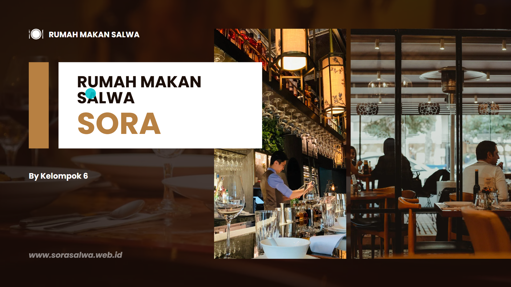
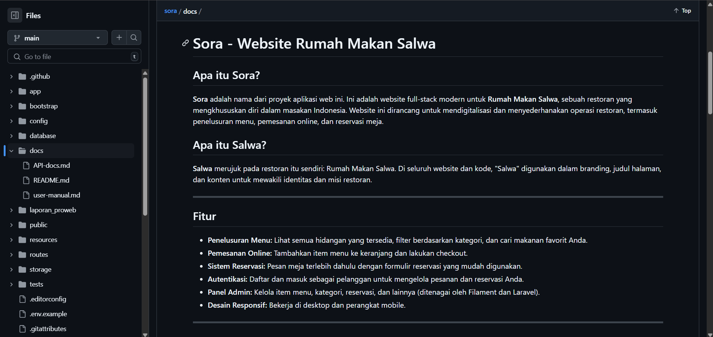
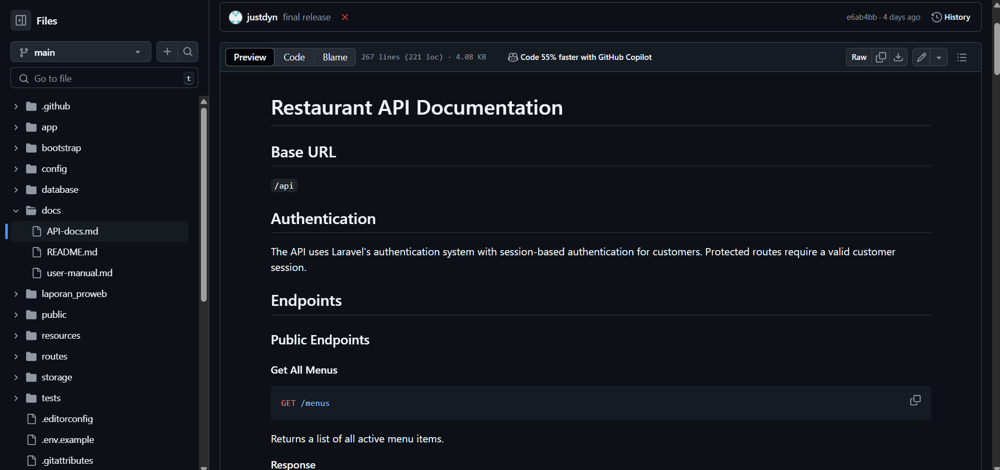
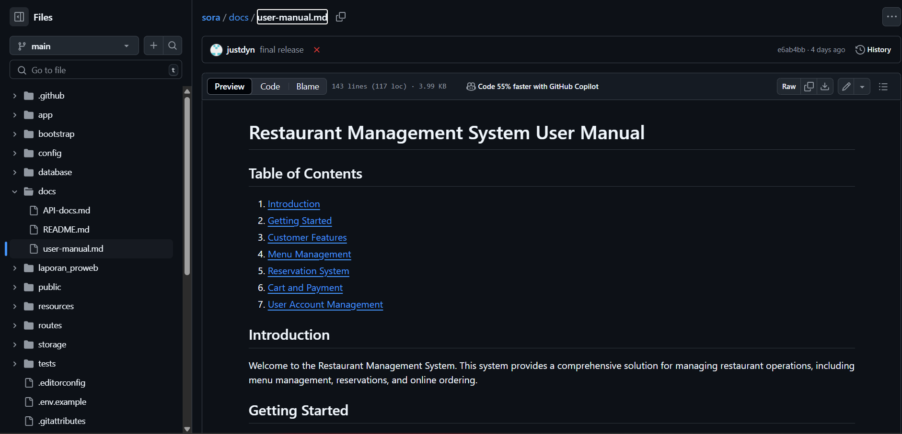
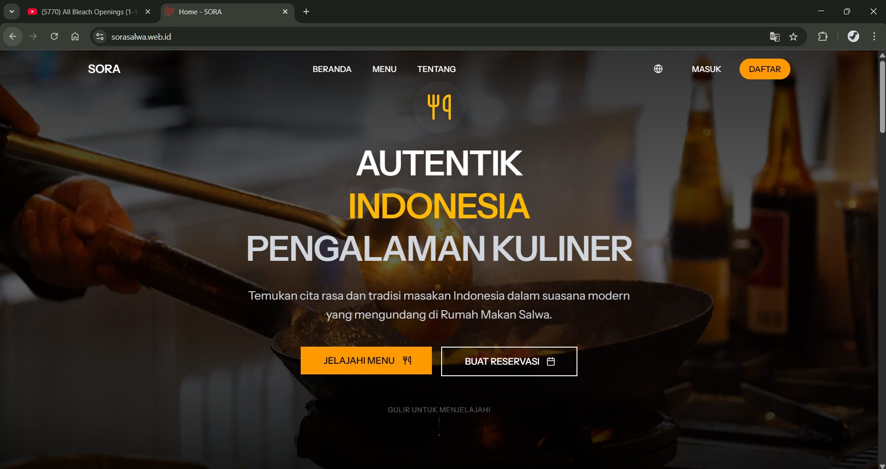

# Laporan Progres Mingguan - SORA
**Kelompok** : 6

**Mitra** : Rumah Makan Salwa

**Pekan ke -** : 15

**Tanggal** : 23/05/2025

---
## Anggota Kelompok ##

- **Amazia Devid Saputra dengan NIM 10231013** 
- **Dyno Fadillah Ramadhani dengan NIM 10231033**
- **Rani Ayu Dewi dengan NIM 10231079**
- **Siti Nur Azizah Putri Awni dengan NIM 10231087**

---

## Progress Summary
Pada minggu terakhir ini, tim telah menyelesaikan seluruh pengembangan aplikasi SORA dengan berhasil melakukan finalisasi dokumentasi, pembuatan tag final di repository GitHub, dan deployment aplikasi ke Cpanel. Presentasi final telah disiapkan dengan lengkap mencakup penjelasan tentang SORA, latar belakang, tujuan, pengguna, teknologi, dan arsitektur sistem.

## Accomplished Tasks
- Menyelesaikan dan memfinalisasi seluruh dokumentasi proyek (README, API docs, user manual)
- Membuat tag final di repository GitHub dan melakukan deployment ke Cpanel
- Menyiapkan presentasi final yang mencakup penjelasan lengkap tentang SORA
- Melakukan final testing dan memastikan semua fitur berjalan dengan baik

## Challenges & Solutions
- **Challenge 1**: Deployment ke Cpanel mengalami kendala karena konfigurasi server yang berbeda
  - **Solution**: Melakukan penyesuaian konfigurasi environment dan memastikan semua dependensi terinstall dengan benar

- **Challenge 2**: Symlink storage mengalami error saat deployment di Cpanel
  - **Solution**: Mengubah konfigurasi penyimpanan file ke folder public/store untuk mengatasi masalah symlink

## Next Week Plan
- Monitoring dan maintenance aplikasi yang sudah di-deploy
- Persiapan untuk penyerahan proyek ke Rumah Makan Salwa
- Evaluasi feedback dari pengguna untuk pengembangan selanjutnya

## Contributions
- **Amazia Devid Saputra**: 
  - Frontend development (React components)
  - API integration
  - State management implementation

- **Dyno Fadillah Ramadhani**: 
  - Backend architecture
  - Filament panel configuration
  - Resource implementation
  - Authentication system

- **Rani Ayu Dewi**: 
  - UI/UX design
  - Frontend routing
  - Component styling
  - API documentation

- **Siti Nur Azizah Putri Awni**: 
  - Database design
  - API development
  - Testing implementation
  - Documentation

## Screenshots / Demo
## 1. Final Presentation: Slide dan demo lengkap (15-20 menit)


https://www.canva.com/design/DAGoIfnGIN8/s2O9yDfJpCp4w7ohQ3B2mg/edit?utm_content=DAGoIfnGIN8&utm_campaign=designshare&utm_medium=link2&utm_source=sharebutton

Presentasi akan menjelaskan:
1. Apa itu SORA
2. Latar Belakang SORA
3. Tujuan SORA
4. Pengguna & Stakeholder
5. Teknologi yang Digunakan
6. Arsitektur Sistem

---

## 2. Complete Documentation: README, API docs, user manual



### README
Sora adalah aplikasi web full-stack modern untuk Rumah Makan Salwa yang menyediakan solusi digital untuk operasi restoran. Aplikasi ini dibangun menggunakan Laravel, React, dan Filament untuk memberikan pengalaman yang mulus baik bagi pelanggan maupun admin.

#### Fitur Utama
- Sistem pemesanan online yang intuitif
- Manajemen menu dan kategori
- Sistem reservasi meja
- Panel admin yang komprehensif
- Autentikasi multi-level (pelanggan, admin, superadmin)
- Desain responsif untuk semua perangkat

#### Teknologi
- **Frontend:** React, Inertia.js, Tailwind CSS, Framer Motion
- **Backend:** Laravel 12 with Filament
- **Database:** MySQL (for Cpanel) / PostgreSQL (for local atau laptop)
- **Admin Panel:** Filament 3.x

### API Documentation


#### Base URL
`/api`

#### Autentikasi
API menggunakan sistem autentikasi Laravel dengan autentikasi berbasis sesi.

#### Endpoint

##### Menu
- `GET /menus` - Mendapatkan semua menu aktif
- `GET /menus/{menu}` - Detail menu spesifik
- `POST /menus` - Membuat menu baru (Admin)
- `PUT /menus/{menu}` - Update menu (Admin)
- `DELETE /menus/{menu}` - Hapus menu (Admin)

##### Kategori
- `GET /categories` - Daftar kategori
- `POST /categories` - Buat kategori baru (Admin)
- `GET /categories/{category}` - Detail kategori
- `PUT /categories/{category}` - Update kategori (Admin)
- `DELETE /categories/{category}` - Hapus kategori (Admin)

##### Keranjang
- `GET /carts` - Daftar item keranjang user
- `POST /carts` - Tambah item ke keranjang
- `PUT /carts/{cart}`

##### Reservasi
- `GET /reservations` - Daftar reservasi user
- `POST /reservations` - Buat reservasi baru
- `GET /reservations/{reservation}` - Detail reservasi
- `PUT /reservations/{reservation}` - Update reservasi
- `DELETE /reservations/{reservation}` - Batalkan reservasi

##### Pembayaran
- `GET /payments` - Daftar pembayaran user
- `POST /payments` - Buat pembayaran baru
- `GET /payments/{payment}` - Detail pembayaran

### User Manual


#### Panduan Pelanggan

1. **Registrasi dan Login**
   - Klik "Daftar" untuk membuat akun baru
   - Isi formulir dengan data yang valid
   - Verifikasi email (opsional)
   - Login menggunakan email dan password

2. **Penelusuran Menu**
   - Gunakan filter kategori untuk menyaring menu
   - Cari menu spesifik menggunakan fitur pencarian
   - Lihat detail menu dengan mengklik item

3. **Pemesanan**
   - Tambahkan item ke keranjang
   - Atur jumlah pesanan
   - Pilih metode pengambilan (dine-in/takeaway)
   - Lanjutkan ke checkout
   - Pilih metode pembayaran
   - Konfirmasi pesanan

4. **Reservasi**
   - Pilih tanggal dan waktu
   - Tentukan jumlah tamu
   - Tambahkan catatan khusus
   - Konfirmasi reservasi

5. **Manajemen Akun**
   - Update profil
   - Lihat riwayat pesanan
   - Kelola reservasi
   - Ubah password

#### Panduan Admin

1. **Login Admin**
   - Akses `/admin`
   - Login dengan kredensial admin

2. **Manajemen Menu**
   - Tambah/edit/hapus menu
   - Atur kategori
   - Upload gambar menu
   - Atur status menu (aktif/nonaktif)

3. **Manajemen Pesanan**
   - Lihat daftar pesanan
   - Update status pesanan
   - Cetak invoice
   - Kelola pembayaran

4. **Manajemen Reservasi**
   - Lihat jadwal reservasi
   - Konfirmasi reservasi
   - Batalkan reservasi
   - Atur kapasitas meja

5. **Laporan**
   - Laporan penjualan
   - Laporan reservasi
   - Statistik pengunjung
   - Export data

#### Panduan Superadmin

1. **Login Superadmin**
   - Akses `/superadmin`
   - Login dengan kredensial superadmin

2. **Manajemen Admin**
   - Tambah/edit/hapus admin
   - Atur hak akses
   - Reset password admin

3. **Konfigurasi Sistem**
   - Pengaturan umum
   - Konfigurasi pembayaran
   - Manajemen backup
   - Log sistem

4. **Monitoring**
   - Dashboard real-time
   - Aktivitas admin
   - Log error
   - Performa sistem

### File Dokumentasi Terpisah
Untuk dokumentasi yang lebih lengkap dan terstruktur, kami menyediakan file-file terpisah berikut:

1. **README.md**
   - Berisi informasi umum tentang proyek
   - Panduan instalasi dan setup
   - Daftar fitur utama
   - Teknologi yang digunakan
   - Kontribusi dan lisensi
   - Lokasi: `/docs/README.md`

2. **API-docs.md**
   - Dokumentasi lengkap API endpoints
   - Format request dan response
   - Contoh penggunaan
   - Autentikasi dan otorisasi
   - Error handling
   - Lokasi: `/docs/API-docs.md`

3. **user-manual.md**
   - Panduan lengkap untuk pengguna
   - Tutorial penggunaan fitur
   - FAQ dan troubleshooting
   - Panduan admin dan superadmin
   - Screenshot dan contoh
   - Lokasi: `/docs/user-manual.md`

Semua file dokumentasi dapat diakses melalui repository GitHub di folder `/docs`.

---

## 3. Source Code: Repo GitHub dengan tag/release final

### Repository Information
- **Main Repository**: https://github.com/brosora6/sora.git
- **Branch**: main
- **Latest Release**: final
- **Release Date**: 23/05/2025

### Repository Structure
```
sora/
├── app/
│   ├── Http/
│   │   ├── Controllers/
│   │   └── Middleware/
│   │
│   ├── Models/
│   └── Services/
│
├── database/
│   ├── migrations/
│   └── seeders/
│
├── resources/
│   ├── js/
│   └── views/
│
├── routes/
│
├── tests/
│
└── docs/
    ├── README.md
    ├── API-docs.md
    └── user-manual.md
```

### How to Clone and Setup
1. Clone the repository:
   ```bash
   git clone https://github.com/brosora6/sora.git
   cd sora
   ```

2. Install dependencies:
   ```bash
   composer install
   npm install
   ```

3. Setup environment:
   ```bash
   cp .env.example .env
   php artisan key:generate
   ```

4. Run migrations and seeders:
   ```bash
   php artisan migrate --seed
   ```

5. Start the development server:
   ```bash
   composer run dev
   ```

### Release Notes
- **final** (23/05/2025)
  - Initial release
  - Deploy on Cpanel hosting
  - Complete restaurant management system
  - Admin panel implementation
  - Online ordering system
  - Table reservation system
  - Payment integration
  - Documentation and user manuals

## 4. Deployed Application: Link aplikasi yang sudah di-deploy (jika ada)

https://sorasalwa.web.id

---

Link Github Repository untuk website : https://github.com/brosora6/sora.git

Link Github Repository untuk Laporan : https://github.com/justdyn/laporan_proweb.git